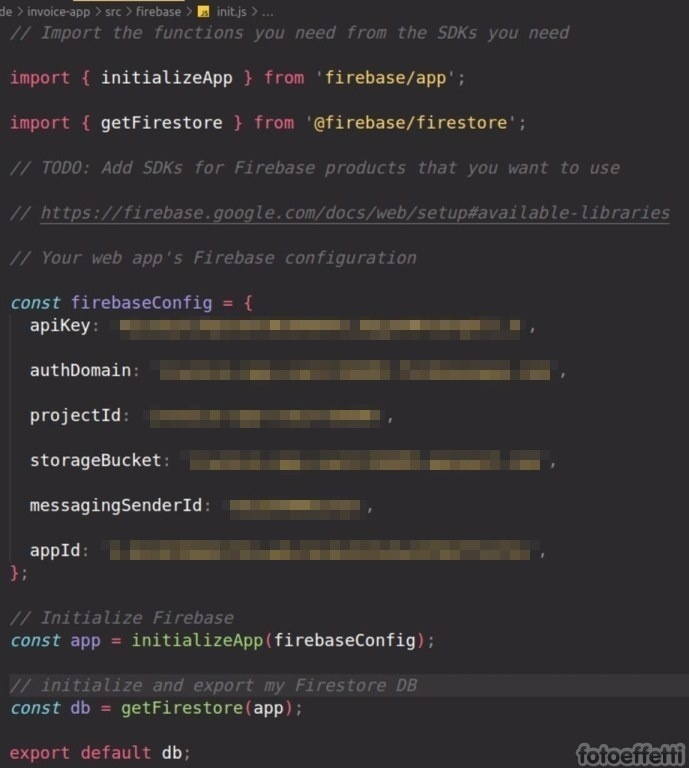

# invoice-app

With this simple app you can create, edit, delete an invoice. For each invoice is possible assign a status (draft, pending, paid) and filter by this.

## Project setup

```
npm install
```

Initialize Firebase and add SDKs for Firebase products.

Create a firebase dir in src with inside a file init.js.

Configure this file with your object firebaseConfig:

<div style="text-align: center">



</div>

To test app you can visit: https://invoice-app-vue3-93dd0.web.app/
